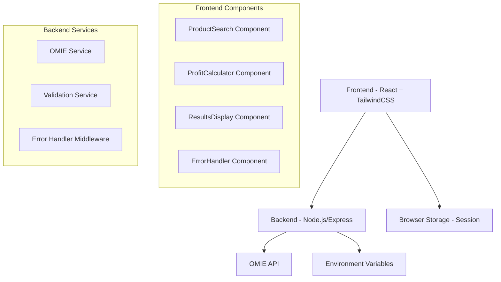

# Design Document

## Overview

O sistema será desenvolvido como uma aplicação web moderna com arquitetura cliente-servidor, utilizando React.js no frontend e Node.js/Express no backend. A aplicação seguirá princípios de design responsivo e será otimizada para performance e segurança, especialmente no que se refere ao manuseio das credenciais da API OMIE.

## Architecture

### High-Level Architecture



### Technology Stack

**Frontend:**
- React.js 18+ com hooks funcionais
- TailwindCSS para estilização responsiva
- Axios para requisições HTTP
- React Hook Form para gerenciamento de formulários
- React Query para cache e gerenciamento de estado de requisições

**Backend:**
- Node.js com Express.js
- Cors middleware para requisições cross-origin
- Helmet para segurança HTTP
- Dotenv para gerenciamento de variáveis de ambiente
- Express-rate-limit para proteção contra spam

**Deployment:**
- Frontend: Vercel ou Netlify
- Backend: Vercel Functions ou Railway

## Components and Interfaces

### Frontend Components

#### 1. App Component (Main Container)
```typescript
interface AppProps {}

const App: React.FC<AppProps> = () => {
  // Estado global da aplicação
  // Gerenciamento de tema/layout
  // Providers de contexto
}
```

#### 2. ProductSearch Component
```typescript
interface ProductSearchProps {
  onProductFound: (product: ProductData) => void;
  onError: (error: string) => void;
}

interface ProductData {
  nIdProduto: number;
  cCodigo: string;
  cDescricao: string;
  nCMC: number;
  fIsico: number;
}
```

#### 3. ProfitCalculator Component
```typescript
interface ProfitCalculatorProps {
  productData: ProductData | null;
  onCalculate: (result: ProfitResult) => void;
}

interface ProfitResult {
  salePrice: number;
  profitMargin: number;
  profitAmount: number;
  isProfit: boolean;
}
```

#### 4. ResultsDisplay Component
```typescript
interface ResultsDisplayProps {
  productData: ProductData;
  profitResult: ProfitResult | null;
}
```

### Backend API Endpoints

#### 1. Product Search Endpoint
```
POST /api/product/search
Content-Type: application/json

Request Body:
{
  "productCode": "PRD00003",
  "date": "11/08/2025" // opcional, default hoje
}

Response:
{
  "success": true,
  "data": {
    "nIdProduto": 243426229,
    "cCodigo": "PRD00003",
    "cDescricao": "Computador",
    "nCMC": 4856.199914,
    "fIsico": 25
  }
}
```

#### 2. Health Check Endpoint
```
GET /api/health

Response:
{
  "status": "ok",
  "timestamp": "2025-08-11T10:00:00Z"
}
```

### OMIE Service Interface
```typescript
interface OMIEService {
  searchProduct(productCode: string, date?: string): Promise<ProductData>;
}

interface OMIERequest {
  call: "ObterEstoqueProduto";
  param: [{
    cCodigo: string;
    nIdProduto: number;
    cEAN: string;
    xCodigo: string;
    dDia: string;
  }];
  app_key: string;
  app_secret: string;
}
```

## Data Models

### Product Data Model
```typescript
interface ProductData {
  nIdProduto: number;        // ID único do produto no OMIE
  cCodigo: string;           // Código do produto
  cDescricao: string;        // Descrição/nome do produto
  nCMC: number;             // Custo médio do produto
  fIsico: number;           // Estoque físico atual
}
```

### Profit Calculation Model
```typescript
interface ProfitCalculation {
  costPrice: number;         // Custo médio (nCMC)
  salePrice: number;         // Preço de venda inserido
  profitAmount: number;      // Lucro em reais
  profitMargin: number;      // Margem de lucro em percentual
  isProfit: boolean;         // Se é lucro (true) ou prejuízo (false)
}
```

### API Response Models
```typescript
interface APIResponse<T> {
  success: boolean;
  data?: T;
  error?: string;
  message?: string;
}

interface ValidationError {
  field: string;
  message: string;
}
```

## Error Handling

### Frontend Error Handling
1. **Network Errors**: Timeout, conexão perdida, servidor indisponível
2. **Validation Errors**: Campos obrigatórios, formatos inválidos
3. **Business Logic Errors**: Produto não encontrado, preço inválido
4. **API Errors**: Erros retornados pela API OMIE

### Error Display Strategy
- Toast notifications para erros temporários
- Inline validation messages para campos de formulário
- Modal dialogs para erros críticos que requerem ação do usuário
- Loading states com possibilidade de cancelamento

### Backend Error Handling
```typescript
interface ErrorResponse {
  success: false;
  error: string;
  code: string;
  details?: any;
}

// Códigos de erro padronizados
enum ErrorCodes {
  PRODUCT_NOT_FOUND = 'PRODUCT_NOT_FOUND',
  INVALID_PRODUCT_CODE = 'INVALID_PRODUCT_CODE',
  OMIE_API_ERROR = 'OMIE_API_ERROR',
  VALIDATION_ERROR = 'VALIDATION_ERROR',
  INTERNAL_ERROR = 'INTERNAL_ERROR'
}
```

## Testing Strategy

### Frontend Testing
1. **Unit Tests**: Componentes individuais com Jest + React Testing Library
2. **Integration Tests**: Fluxos completos de busca e cálculo
3. **E2E Tests**: Cypress para testes de interface completos
4. **Visual Regression Tests**: Storybook + Chromatic

### Backend Testing
1. **Unit Tests**: Serviços e utilitários com Jest
2. **Integration Tests**: Endpoints da API com Supertest
3. **Mock Tests**: Simulação da API OMIE para testes isolados

### Test Coverage Goals
- Mínimo 80% de cobertura de código
- 100% de cobertura para lógica de cálculo de margem
- Testes obrigatórios para todos os cenários de erro

### Performance Testing
1. **Load Testing**: Simular múltiplas requisições simultâneas
2. **Response Time**: Garantir resposta < 2s para busca de produtos
3. **Bundle Size**: Frontend otimizado para carregamento rápido

## Security Considerations

### API Security
1. **Credential Protection**: app_key e app_secret apenas no backend
2. **HTTPS Enforcement**: Todas as comunicações criptografadas
3. **Rate Limiting**: Proteção contra abuso da API
4. **Input Validation**: Sanitização de todos os inputs do usuário

### Environment Configuration
```bash
# Backend .env
OMIE_APP_KEY=sua_app_key_aqui
OMIE_APP_SECRET=seu_app_secret_aqui
OMIE_API_URL=https://app.omie.com.br/api/v1/estoque/resumo/
PORT=3001
NODE_ENV=production
```

### CORS Configuration
```typescript
const corsOptions = {
  origin: process.env.FRONTEND_URL || 'http://localhost:3000',
  credentials: true,
  optionsSuccessStatus: 200
};
```

## UI/UX Design Specifications

### Color Palette
- Primary: #2563eb (Blue 600)
- Secondary: #10b981 (Emerald 500) 
- Success: #059669 (Emerald 600)
- Error: #dc2626 (Red 600)
- Warning: #d97706 (Amber 600)
- Neutral: #6b7280 (Gray 500)

### Typography
- Headings: Inter font, weights 600-700
- Body text: Inter font, weight 400
- Monospace: JetBrains Mono para valores monetários

### Responsive Breakpoints
- Mobile: < 640px
- Tablet: 640px - 1024px  
- Desktop: > 1024px

### Component Layout
```
┌─────────────────────────────────────┐
│           Header/Logo               │
├─────────────────────────────────────┤
│  [Código do Produto] [Buscar]       │
├─────────────────────────────────────┤
│  Produto: Computador                │
│  Custo Médio: R$ 4.856,20          │
│  Estoque: 25 unidades               │
├─────────────────────────────────────┤
│  [Preço de Venda: R$ ____]         │
├─────────────────────────────────────┤
│  💰 Margem: -4.756,20%             │
│  💸 Lucro: -R$ 4.756,20            │
└─────────────────────────────────────┘
```